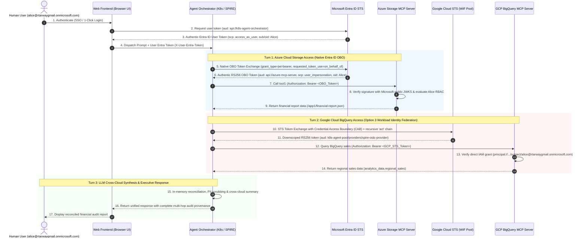

# Multi-Cloud Agentic Ecosystem & Workload Identity Federation (WIF) POC
### Azure Cloud Storage &bull; Google Cloud BigQuery &bull; RFC 8693 Multi-Hop Recursive Actor Chains &bull; Low-Code Declarative MCP Server (July 2026 Spec)

[](./scripts/test-all.sh)
[](./docs/multi-hop-actor-chain-guide.md)
[](./app/mcp-server/tools.yaml)

This repository provides an enterprise-grade Proof-of-Concept (POC) demonstrating an **Agent Ecosystem** deployed on **Kubernetes (SPIRE + Istio)** securely accessing **Low-Code Declarative Model Context Protocol (MCP) Servers** across **Microsoft Azure (Cloud Storage & Graph API)** and **Google Cloud Platform (BigQuery)**.

It proves **secret-free Workload Identity Federation (WIF)**, **direct subject IAM grants in Google Cloud IAM without enterprise organization sprawl**, **authentic Microsoft Entra ID RS256 PKI tokens verified via public JWKS**, **RFC 8693 Section 4.1 multi-hop recursive delegation chains (`act`)**, **Fine-Grained Parameter (FGP) policies**, and **cross-cloud multi-turn agent synthesis** while strictly preserving the originating human user (`sub`) across cloud boundaries with zero fake/symmetric HMAC tokens.

---

## ⚡ Quick Start

### 1. Run the Automated Verification Suite (50/50 Tests)
```bash
./scripts/test-all.sh
```
Runs test suites across all 4 services:
- `app/web-frontend`: 8/8 passed
- `app/agent-orchestrator`: 18/18 passed
- `app/mcp-server` (Azure): 12/12 passed (tested against Entra ID RS256 PKI)
- `app/gcp-mcp-server` (GCP BigQuery): 12/12 passed (tested against Google Cloud STS RS256 PKI)
- `k8s manifests`: 5/5 validated

### 2. Run the CLI Multi-Cloud Demo
```bash
./scripts/run-demo.sh
```
Executes end-to-end scenarios showcasing:
- **Scenario A**: Alice (Admin) calling Azure MCP Tool 1 (`mcp:tool1` -> `app1` allowed)
- **Scenario B**: Bob (Regular User) calling Azure MCP Tool 1 (`mcp:tool1` -> `app2` allowed)
- **Scenario C**: Bob attempting Azure MCP Tool 2 (Rejected with native MCP `{ isError: true }`)
- **Scenario D**: Alice executing GCP BigQuery Sales Query (`analytics_data.regional_sales`) via direct IAM grant
- **Scenario E**: Bob blocked from GCP BigQuery Audit Compliance (Role & scope mismatch)
- **Scenario F**: Fine-Grained Parameter (FGP) Wildcard Blocking (`SELECT *` rejected)
- **Scenario G**: Multi-Hop Cross-Cloud Pipeline: Turn 1 (Azure Storage) &rarr; Turn 2 (GCP BigQuery with recursive `act` chain) &rarr; Turn 3 (Cross-cloud synthesis & PII masking)

### 3. Deploy to Local Kubernetes
```bash
./scripts/install-infra.sh
```
Access points:
- **Web Frontend**: `http://localhost:3000` (Outside SPIRE for direct browser HTTP)
- **Keycloak IdP**: `http://localhost:8080` (Realm: `azure-wif-realm`)
- **Agent Orchestrator**: `http://localhost:3001` (Inside SPIRE + Istio)
- **Azure MCP Server**: `http://localhost:8080` (Port 8080 or deployed on Azure App Service)
- **GCP MCP Server**: `http://localhost:8081` (Port 8081 or deployed on Cloud Run)

---

## 🎯 Architectural Overview

### Multi-Cloud Cross-Cloud Delegation Flow


### 1. Microsoft Entra ID Native OBO Delegated Token (Turn 1 -> Azure MCP)
```json
{
  "aud": "api://d5850aa0-a667-41c3-8dd0-16f2dee4da25",
  "iss": "https://sts.windows.net/81f26b58-159c-4879-80a0-bab30b5b4dd3/",
  "sub": "1Gb5kjxZoWHFZg_kF96ChAANCZF7CtHh0LZPJ-pjhrw",
  "oid": "f0717748-78aa-43ae-a396-56df193e50ea",
  "upn": "alice@rtarwaygmail.onmicrosoft.com",
  "appid": "a23206e1-2dda-4854-aac7-0536d2da2c4c",
  "scp": "user_impersonation"
}
```

### 2. Google Cloud WIF & RFC 8693 §4.1 Recursive Delegation Claim (Turn 2 -> GCP MCP)
```json
{
  "iss": "https://sts.googleapis.com",
  "aud": "//iam.googleapis.com/projects/834200279688/locations/global/workloadIdentityPools/k8s-agent-pool/providers/spire-oidc-provider",
  "sub": "alice@rtarwaygmail.onmicrosoft.com",
  "scope": "mcp:bigquery:query",
  "google_cloud_iam": {
    "projectId": "wifdemoproject-507002",
    "projectNumber": "834200279688",
    "poolId": "k8s-agent-pool",
    "principal": "principal://iam.googleapis.com/projects/834200279688/locations/global/workloadIdentityPools/k8s-agent-pool/subject/alice@rtarwaygmail.onmicrosoft.com"
  },
  "act": {
    "sub": "spiffe://example.org/ns/agent-system/sa/orchestrator-sa",
    "act": {
      "sub": "urn:agent:reasoning-engine:gemini-planner",
      "act": {
        "sub": "spiffe://example.org/ns/azure/sa/azure-mcp-server"
      }
    }
  }
}
```

---

## 📁 Repository Structure

```text
multicloud-agentic-ecosystem/
├── package.json                        # Root package scripts (test, test:all, demo)
├── app/                                # Application microservices
│   ├── web-frontend/                   # Web UI (Outside SPIRE)
│   │   ├── public/index.html           # Interactive UI with Scenarios A-J and Live Token Inspector
│   │   ├── src/index.js                # Express server & Keycloak auth proxy
│   │   ├── test/frontend.test.js       # Automated tests (8/8 passed)
│   │   └── Dockerfile
│   ├── agent-orchestrator/             # A2A Agent Orchestrator (Inside SPIRE + Istio)
│   │   ├── src/index.js                # Express service & Cross-Cloud Pipeline dispatch
│   │   ├── src/llmSimulator.js         # Multi-turn cross-cloud planning & PII redaction
│   │   ├── src/tokenExchange.js        # RFC 8693 Google/Azure STS & Recursive Actor Chains
│   │   ├── src/opaPolicy.js            # OPA authorization & fine-grained tool policies
│   │   ├── src/spireClient.js          # SPIRE Workload API client
│   │   ├── test/orchestrator.test.js   # Automated tests (18/18 passed)
│   │   └── Dockerfile
│   ├── mcp-server/                     # Azure Cloud Storage Declarative MCP Server
│   │   ├── tools.yaml                  # Declarative tool registry (July 2026 Spec: 2026-07-15)
│   │   ├── src/index.js                # MCP Protocol runtime with native { isError: true }
│   │   ├── src/declarativeEngine.js    # FGP parameter validator
│   │   ├── src/azureStorage.js         # Azure Blob Storage JIT User-Delegation binding
│   │   ├── src/auth.js                 # RFC 8693 recursive act verification & scope checks
│   │   ├── test/mcp.test.js            # Automated tests (12/12 passed)
│   │   └── Dockerfile
│   └── gcp-mcp-server/                 # Google Cloud BigQuery Declarative MCP Server
│       ├── tools.yaml                  # Declarative tools (bigquery_query_sales, audit)
│       ├── src/index.js                # MCP Server on port 8081
│       ├── src/auth.js                 # Recursive act & GCP STS validation
│       ├── src/declarativeEngine.js    # FGP wildcard SQL blocking & parameter validation
│       ├── src/bigqueryClient.js       # BigQuery client wrapper
│       ├── test/gcp-mcp.test.js        # Automated tests (12/12 passed)
│       └── Dockerfile
├── terraform/                          # Infrastructure provisioning
│   ├── gcp/                            # Google Cloud Workload Identity Federation & BigQuery
│   │   ├── main.tf                     # Workload Identity Pool, Provider, Datasets, Direct Project IAM Grants
│   │   ├── variables.tf
│   │   └── outputs.tf
│   ├── spire.tf                        # SPIRE CRDs, Server, Agent, SPIFFE CSI Driver
│   ├── istio.tf                        # Istio mesh (Citadel CA disabled, SPIRE mTLS)
│   └── keycloak.tf                     # Keycloak deployment with auto-import
├── k8s/                                # Kubernetes manifests
│   ├── gcp-mcp-server-deployment.yaml  # GCP MCP Server deployment (Port 8081)
│   ├── mcp-server-deployment.yaml      # Azure MCP Server deployment (Port 8080)
│   ├── agent-orchestrator-deployment.yaml
│   └── web-frontend-deployment.yaml
├── scripts/                            # Automation & Verification
│   ├── test-all.sh                     # Unified test suite (50/50 tests)
│   └── run-demo.sh                     # CLI Demo runner (Scenarios A through G)
└── docs/                               # Architecture and Guides
    ├── multi-hop-actor-chain-guide.md  # RFC 8693 §4.1, NIST SP 800-207, MAESTRO, OWASP Guide
    ├── gcp-wif-bigquery-guide.md       # Google Cloud WIF & BigQuery MCP Guide
    ├── architecture.md                 # Complete Architecture & Security Deep Dive
    ├── azure-setup-guide.md            # Azure WIF & Storage Account Provisioning
    ├── low-code-declarative-mcp-guide.md # Low-Code Declarative Tools & FGP Guide
    └── demo-guide.md                   # Presenter Step-by-Step Runbook
```

---

## 📚 Documentation Links

* 🔗 **[Multi-Hop Actor Delegation & Provenance Architecture Guide](./docs/multi-hop-actor-chain-guide.md)**: Deep dive into RFC 8693 §4.1 recursive actor chains, NIST SP 800-207 Zero Trust, OWASP Top 10 for Agentic AI, and MAESTRO framework.
* 🌐 **[B2B Identity Federation & Native Entra OBO Architecture Guide](./docs/b2b-identity-federation-prerequisites-guide.md)**: Detailed breakdown of Path A (Native Entra ID OBO Token Exchange) and Path B (Enterprise B2B Direct Federation Roadmap).
* ☁️ **[Google Cloud Workload Identity Federation & BigQuery MCP Guide](./docs/gcp-wif-bigquery-guide.md)**: Google STS token exchange, Credential Access Boundaries, and declarative BigQuery querying.
* ☁️ **[Azure Setup & Workload Identity Federation (WIF) Guide](./docs/azure-setup-guide.md)**: Provisioning Azure resources, Entra ID Federated Credentials, and Storage Accounts.
* 🏛️ **[Complete Architecture & Security Deep Dive](./docs/architecture.md)**: Comprehensive architectural reference.
* 🛠️ **[Low-Code Declarative MCP Guide](./docs/low-code-declarative-mcp-guide.md)**: Declarative tool definition in `tools.yaml` (July 2026 spec) and FGP enforcement.
* 🎬 **[Step-by-Step Presenter Demo Guide](./docs/demo-guide.md)**: Detailed runbook for presenting live demos.
