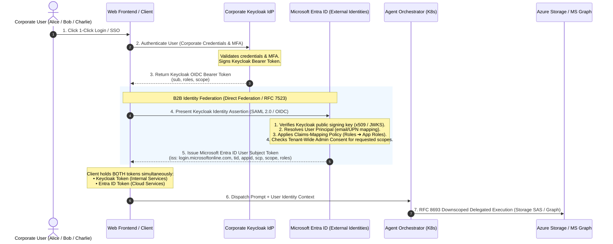
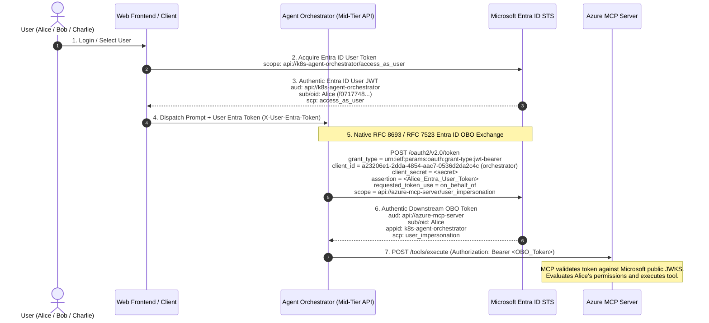
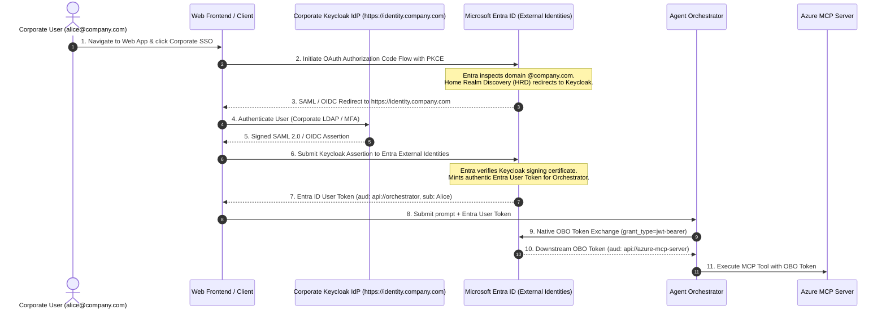

# Enterprise Guide: B2B Identity Federation Prerequisites & Setup

This guide details the complete organizational and technical pre-requisites required to configure **B2B Identity Federation** between an enterprise Identity Provider (**Keycloak**, Okta, Ping, or ADFS) and **Microsoft Entra ID (Azure AD)**. 

This setup enables a seamless, single-login user experience that automatically issues **both** a Corporate Keycloak OIDC Bearer Token and an authentic Microsoft Entra ID User Subject Token for cloud-native delegated access (Azure Blob Storage and Microsoft Graph API).

---

## 📋 Table of Contents
1. [Architecture & Identity Flow Overview](#1-architecture--identity-flow-overview)
2. [Organizational & Administrative Prerequisites](#2-organizational--administrative-prerequisites)
3. [Phase 1: Corporate IdP (Keycloak) Setup](#3-phase-1-corporate-idp-keycloak-setup)
4. [Phase 2: Microsoft Entra ID Direct Federation](#4-phase-2-microsoft-entra-id-direct-federation)
5. [Phase 3: Claims Mapping & Scope Synchronization](#5-phase-3-claims-mapping--scope-synchronization)
6. [Phase 4: Application Registrations & Delegated Scopes](#6-phase-4-application-registrations--delegated-scopes)
7. [Phase 5: Cloud Storage RBAC & Security Hardening](#7-phase-5-cloud-storage-rbac--security-hardening)
8. [Phase 6: Automated User Lifecycle Provisioning (SCIM 2.0)](#8-phase-6-automated-user-lifecycle-provisioning-scim-20)
9. [Step-by-Step Verification & Troubleshooting](#9-step-by-step-verification--troubleshooting)

---

## 1. Architecture & Identity Flow Overview

In this hybrid multi-cloud agentic architecture:
- **Corporate Keycloak** is the **Authoritative Identity Provider (IdP)** holding human credentials, passwords, multi-factor authentication (MFA), and corporate directory groups.
- **Microsoft Entra ID** is the **Resource & Cloud Governance Authority**, validating federated identities to issue OAuth 2.0 tokens for Azure Cloud Storage, Microsoft Graph, and enterprise microservices.



---

## 2. Organizational & Administrative Prerequisites

Before beginning configuration, the following enterprise roles and assets must be established:

### A. Required Administrative Roles
| System | Required Role | Purpose |
| :--- | :--- | :--- |
| **Microsoft Entra ID** | **Global Administrator** or **External Identity Provider Administrator** | Configure Direct Federation, Identity Providers, and Cross-Tenant Access Settings. |
| **Microsoft Entra ID** | **Application Administrator** or **Cloud Application Administrator** | Register client applications, expose API scopes, and grant Tenant-Wide Admin Consent. |
| **Azure Subscription** | **Owner** or **User Access Administrator** | Assign Azure RBAC roles (`Storage Blob Data Reader`, `Storage Blob Data Contributor`). |
| **Corporate Keycloak** | **Realm Administrator** (`admin-cli` or Realm Admin UI) | Create SAML/OIDC clients, configure protocol attribute mappers, and export certificates. |
| **Corporate Network / DNS** | **DNS Administrator** | Manage public DNS records and TLS certificates for the Keycloak domain. |

### B. Network & Endpoint Connectivity
1. **Publicly Reachable or Reverse-Proxied Metadata Endpoints**:
   - Microsoft Entra ID must be able to resolve and reach Keycloak's passive authentication endpoint and JWKS/metadata URLs over HTTPS (port 443) using a **globally trusted TLS certificate** (DigiCert, Let's Encrypt, Sectigo). Self-signed root CAs are rejected by Entra ID.
2. **Corporate Domain**:
   - The email domain used by federating users (e.g. `@example.com` or `@company.com`) must be designated for Direct Federation. 
   - *Note*: If the domain is already verified as an unmanaged or managed tenant domain in another Microsoft 365 tenant, it must be freed or federated via External Identities.

---

## 3. Phase 1: Corporate IdP (Keycloak) Setup

### Step 1.1: Export Keycloak SAML Signing Certificate
Microsoft Entra ID requires the public X.509 certificate used by Keycloak to sign SAML assertions.

1. Navigate to Keycloak Admin Console: **Realm Settings** ➔ **Keys** tab.
2. Locate the active `RSA` key with provider `rsa-generated`.
3. Click **Certificate** and copy the Base64 content, or run the provided setup script:
```bash
node scripts/setup-keycloak-entra-federation.js
```
4. Save the certificate locally as `keycloak-saml.cer`:
```text
-----BEGIN CERTIFICATE-----
MIICljCCAX4CAQAwDQYJKoZIhvcNAQELBQAw...
...[Base64 Keycloak Signing Certificate]...
-----END CERTIFICATE-----
```

### Step 1.2: Register the Microsoft Entra SAML 2.0 Client
1. In Keycloak, navigate to **Clients** ➔ **Create Client**:
   - **Client type**: `SAML`
   - **Client ID**: `https://login.microsoftonline.com/<ENTRA_TENANT_ID>/federation`
   - **Name**: `Microsoft Entra Direct Federation`
2. Configure **Client Settings**:
   - **Sign Assertions**: `ON` (Required by Entra ID)
   - **Sign Documents**: `ON`
   - **Signature Algorithm**: `RSA_SHA256`
   - **SAML NameID format**: `email` (or `persistent`)
   - **Force NameID format**: `ON`
   - **Valid redirect URIs**:
     - `https://login.microsoftonline.com/common/federation/externalfederationauth`
     - `https://login.microsoftonline.com/<ENTRA_TENANT_ID>/federation/externalfederationauth`
     - `https://login.microsoftonline.com/common/oauth2/nativeclient`

### Step 1.3: Configure SAML Protocol Attribute Mappers
Entra ID expects standard WS-Federation and XMLSoap claims. In the SAML Client, open **Client Scopes** / **Mappers** and add:

1. **Email Claim Mapper**:
   - Name: `email`
   - Mapper Type: `User Property`
   - Property: `email`
   - SAML Attribute Name: `http://schemas.xmlsoap.org/ws/2005/05/identity/claims/emailaddress`
   - Name Format: `Basic`
2. **Display Name Mapper**:
   - Name: `name`
   - Mapper Type: `User Property`
   - Property: `username`
   - SAML Attribute Name: `http://schemas.xmlsoap.org/ws/2005/05/identity/claims/name`
   - Name Format: `Basic`
3. **Role / Group List Mapper**:
   - Name: `roles`
   - Mapper Type: `Role list`
   - SAML Attribute Name: `http://schemas.microsoft.com/ws/2008/06/identity/claims/role`
   - Single Role Attribute: `false`

---

## 4. Phase 2: Microsoft Entra ID Direct Federation

Direct Federation establishes trust with Keycloak without requiring users to exist in Entra ID beforehand (Just-in-Time B2B Collaboration guest/workforce creation).

### Step 2.1: Add Direct Federation IdP via Azure Portal
1. Sign in to the **Azure Portal** ([portal.azure.com](https://portal.azure.com)) as **Global Administrator**.
2. Navigate to **Microsoft Entra ID** ➔ **External Identities** ➔ **All identity providers**.
3. Select **New SAML/WS-Fed IdP**:
   - **Display Name**: `Corporate Keycloak IdP`
   - **Identity provider protocol**: `SAML`
   - **Domain name of federating IdP**: `company.com` (e.g. `rtarwaygmail.onmicrosoft.com` or partner domain)
   - **Issuer URI**: `http://<KEYCLOAK_HOST>:8080/realms/azure-wif-realm` (matches Keycloak Realm entity ID)
   - **Passive authentication endpoint**: `http://<KEYCLOAK_HOST>:8080/realms/azure-wif-realm/protocol/saml`
   - **Certificate**: Upload the `keycloak-saml.cer` exported in Phase 1.
4. Click **Save**.

### Step 2.2: CLI Configuration (Alternative via Azure CLI / Microsoft Graph)
```bash
az rest --method POST \
  --uri "https://graph.microsoft.com/v1.0/identity/identityProviders" \
  --headers "Content-Type=application/json" \
  --body '{
    "@odata.type": "#microsoft.graph.samlOrWsFedExternalIdentityProvider",
    "displayName": "Corporate Keycloak IdP",
    "issuerUri": "http://keycloak.company.com:8080/realms/azure-wif-realm",
    "passiveSignInUri": "http://keycloak.company.com:8080/realms/azure-wif-realm/protocol/saml",
    "preferredAuthenticationProtocol": "saml",
    "signingCertificate": "'$(cat certs/keycloak-saml.cer | grep -v CERTIFICATE | tr -d '\n')'"
  }'
```

---

## 5. Phase 3: Claims Mapping & Scope Synchronization

Federation protocols (SAML 2.0 and standard OIDC) exchange **identity attributes** (subject, email, groups, roles), **NOT** arbitrary OAuth 2.0 API scopes. Organizations must establish a synchronization bridge between Keycloak roles and Microsoft Entra ID scopes.

### Step 3.1: Azure AD Claims-Mapping Policy
Create a claims mapping policy to translate inbound Keycloak role assertions into Entra ID directory claims and Application Roles:

```powershell
# Connect to Azure AD PowerShell
Connect-AzureAD

# Define the Claims-Mapping Policy
$ClaimsPolicy = @'
{
  "ClaimsMappingPolicy": {
    "Version": 1,
    "IncludeBasicClaimSet": "true",
    "ClaimsSchema": [
      {
        "Source": "PartnerClaim",
        "ID": "http://schemas.xmlsoap.org/ws/2005/05/identity/claims/emailaddress",
        "JwtClaimType": "email"
      },
      {
        "Source": "PartnerClaim",
        "ID": "http://schemas.microsoft.com/ws/2008/06/identity/claims/role",
        "JwtClaimType": "roles"
      }
    ]
  }
}
'@

# Create the Policy in Entra ID
$PolicyObj = New-AzureADPolicy `
  -Definition @($ClaimsPolicy) `
  -DisplayName "KeycloakFederationClaimsPolicy" `
  -Type "ClaimsMappingPolicy"

# Assign Policy to the Web Frontend Service Principal
Add-AzureADServicePrincipalPolicy `
  -Id "<SERVICE_PRINCIPAL_OBJECT_ID>" `
  -RefObjectId $PolicyObj.Id
```

### Step 3.2: Scope Synchronization Architecture: Why Both `scp` and `scope` Exist
When an access token is minted by Microsoft Entra ID:
- **`scp`**: Microsoft's proprietary claim for delegated scopes (e.g. `"mcp:tool1 Mail.Send"`).
- **`scope`**: The official IETF RFC 6749 claim name.
- **Enterprise Rule**: Entra ID token issuance configurations (or token federation gateways) should include both to support Microsoft native SDKs (`@azure/identity`) and standard OAuth 2.0 libraries (Passport.js, Go OAuth2) simultaneously.

---

## 6. Phase 4: Application Registrations & Delegated Scopes

Two App Registrations must be configured in Microsoft Entra ID:
1. **Frontend App Registration** (`azure-wif-web-frontend`): Client app that receives the human user's login.
2. **Azure MCP Server App Registration** (`azure-mcp-server`): Exposes custom tool execution scopes.

### Step 4.1: Register and Expose Custom Scopes on Azure MCP Server
1. In Entra ID, navigate to **App registrations** ➔ **New registration**:
   - Name: `azure-mcp-server`
   - Supported account types: *Accounts in this organizational directory only*
2. Under **Expose an API**:
   - **Application ID URI**: `api://d5850aa0-a667-41c3-8dd0-16f2dee4da25` (or custom URI)
   - Click **Add a scope**:
     - Scope name: `mcp:tool1`
     - Who can consent: `Admins and users`
     - Admin display name: `Execute Tool 1 (Storage Read/Write)`
     - Admin description: `Allows calling tool1 for reading and writing blobs in permitted storage containers.`
   - Click **Add a scope**:
     - Scope name: `mcp:tool2`
     - Who can consent: `Admins only`
     - Admin display name: `Execute Tool 2 (Admin Compliance Audit)`
     - Admin description: `Allows calling tool2 for executing administrative storage audits.`

### Step 4.2: Configure Delegated Permissions & Tenant-Wide Admin Consent
1. In the **Frontend App Registration** (`azure-wif-web-frontend`):
   - Navigate to **API permissions** ➔ **Add a permission**.
   - Select **My APIs** ➔ Select `azure-mcp-server`:
     - Select **Delegated permissions**: check `mcp:tool1` and `mcp:tool2`.
   - Select **Microsoft Graph**:
     - Select **Delegated permissions**: check `Mail.Send` and `User.Read`.
   - Select **Azure Storage**:
     - Select **Delegated permissions**: check `user_impersonation`.
2. **Execute Tenant-Wide Admin Consent**:
   - Click **Grant admin consent for <TenantName>** button.
   - *Why this is mandatory*: Without Admin Consent, federated B2B users will encounter interactive consent roadblocks or `AADSTS65001: The user or administrator has not consented to use the application` errors during autonomous agent execution.

---

## 7. Phase 5: Cloud Storage RBAC & Security Hardening

Fine-grained access to Azure Storage containers must be granted directly to the federated user identities or security groups, **never** to static service accounts.

### Step 5.1: Assign Azure Storage Cloud IAM Roles
Using Azure CLI, assign native Azure RBAC roles on the Storage Account (`azwifstoragepocrt`):

```bash
SUBSCRIPTION_ID=$(az account show --query id -o tsv)
STORAGE_ID="/subscriptions/${SUBSCRIPTION_ID}/resourceGroups/rg-azure-wif-poc/providers/Microsoft.Storage/storageAccounts/azwifstoragepocrt"

# 1. Assign Alice 'Storage Blob Data Reader' across both app1 & app2
az role assignment create \
  --assignee "alice@rtarwaygmail.onmicrosoft.com" \
  --role "Storage Blob Data Reader" \
  --scope "${STORAGE_ID}"

# 2. Assign Bob 'Storage Blob Data Contributor' strictly on app2 container
az role assignment create \
  --assignee "bob@rtarwaygmail.onmicrosoft.com" \
  --role "Storage Blob Data Contributor" \
  --scope "${STORAGE_ID}/blobServices/default/containers/app2"

# 3. Assign Charlie 'Storage Blob Data Reader' across both app1 & app2
az role assignment create \
  --assignee "charlie@rtarwaygmail.onmicrosoft.com" \
  --role "Storage Blob Data Reader" \
  --scope "${STORAGE_ID}"
```

### Step 5.2: Permanently Disable Storage Shared Account Keys
To eliminate lateral movement and ensure zero-trust user delegation:
```bash
az storage account update \
  --name azwifstoragepocrt \
  --resource-group rg-azure-wif-poc \
  --allow-shared-key-access false
```
*Result*: Storage account root keys are permanently rejected. Azure Storage will only authorize requests authenticated via **OAuth 2.0 User-Delegation credentials**.

---

## 8. Phase 6: Automated User Lifecycle Provisioning (SCIM 2.0)

In enterprise production deployments, manual user mapping is replaced by automated directory synchronization using **SCIM 2.0 (System for Cross-domain Identity Management)**.

```
+--------------------------+         SCIM 2.0 Push          +---------------------------+
|    Corporate Keycloak    | -----------------------------> |    Microsoft Entra ID     |
| • User Creation          |   POST /Users (JSON Payload)   | • Guest / Member Created  |
| • Role Assignment        |   PATCH /Groups (Membership)   | • App Role Assigned       |
| • Immediate Revocation   |   DELETE /Users/{id}           | • JIT Access Revoked      |
+--------------------------+                                +---------------------------+
```

1. **In Microsoft Entra ID**:
   - Navigate to **Enterprise Applications** ➔ Select your application ➔ **Provisioning**.
   - Provisioning Mode: `Automatic`.
   - Copy the **Tenant URL** (`https://graph.microsoft.com/beta/scim/...`) and generate a **Secret Token**.
2. **In Corporate Keycloak / Identity Governance System**:
   - Configure the SCIM 2.0 outbound synchronization extension (or use SailPoint / Okta / Azure AD Connect).
   - Enter the Entra SCIM URL and bearer token.
   - Configure sync rules:
     - When a user is added to `Auditor` group in Keycloak ➔ Entra ID assigns `mcp:tool1`, `mcp:tool2`, and `Storage Blob Data Reader`.
     - When `Mail.Send` is revoked for Charlie in Keycloak ➔ SCIM removes Charlie from the Entra ID mail-enabled security group instantly.

---

## 9. Step-by-Step Verification & Troubleshooting

### Verification 1: Verify Direct Federation Endpoint Discovery
Verify that Microsoft Entra ID Home Realm Discovery (HRD) correctly recognizes the federated domain:
```bash
curl -I "https://login.microsoftonline.com/common/userrealm/alice@company.com?api-version=2.1"
```
*Expected Output*:
```json
{
  "NameSpaceType": "Federated",
  "FederationBrandName": "Corporate Keycloak IdP",
  "AuthURL": "http://keycloak.company.com:8080/realms/azure-wif-realm/protocol/saml"
}
```

### Verification 2: Verify Dual Token Issuance on Login
Test the B2B federation token endpoint:
```bash
curl -s -X POST http://localhost:30000/api/login \
  -H "Content-Type: application/json" \
  -d '{"userType":"alice"}' | jq '{authenticated, keycloakSub: .token, entraIss: .entraToken}'
```

### Common Troubleshooting Pitfalls & Solutions
| Symptom | Root Cause | Remediation |
| :--- | :--- | :--- |
| `AADSTS50107: The requested federation realm object does not exist.` | Mismatch between Keycloak Realm Entity ID and the `issuerUri` registered in Entra ID. | Ensure `issuerUri` matches the exact URI string in Keycloak SAML settings (including trailing slashes and port numbers). |
| `AADSTS50008: SAML token is invalid. Signature validation failed.` | Keycloak rotated its signing certificate, but Entra ID still caches the old certificate. | Re-export `keycloak-saml.cer` and update the Identity Provider certificate in Entra ID. |
| `AADSTS65001: The user or administrator has not consented to use the application.` | Missing Tenant-Wide Admin Consent for delegated scopes (`Mail.Send`, `mcp:tool1`). | In Entra ID App Registrations ➔ API Permissions, click **"Grant admin consent for [Tenant]"**. |
| `HTTP 403 Forbidden` on Azure Storage Container `app1` for Bob. | **Expected Behavior**: Cloud IAM enforcement working correctly. | Bob only holds `Storage Blob Data Contributor` on `app2`. Azure Storage native kernel correctly blocks access to `app1`. |
| `HTTP 403 Forbidden` on Step 4 (Graph Email) for Charlie. | **Expected Behavior**: Scope synchronization & downscoping working correctly. | Charlie lacks the `Mail.Send` scope on Keycloak and Entra ID. The Orchestrator halts execution before sending unauthorized emails. |

---

---

## 10. Implementation Architecture: Path A (Current Live Native OBO) vs. Path B (Production B2B Federation Roadmap)

### Path A: Direct Entra ID Native OBO Flow (Implemented & Verified Live)
In environments where the Corporate Keycloak instance runs on local infrastructure (`localhost:8080` or internal Kubernetes cluster without a publicly resolvable domain or trusted commercial TLS certificate), **Path A** implements the full end-to-end On-Behalf-Of delegation flow directly using Microsoft Entra ID's native STS:



**Key Path A Implementation Details**:
- **Application Scopes**:
  - `k8s-agent-orchestrator` exposes `access_as_user`.
  - `azure-mcp-server` exposes `user_impersonation`.
- **Pre-Authorization**: `k8s-agent-orchestrator` is pre-authorized on `azure-mcp-server` with tenant-wide admin consent.
- **Cryptographic Validation**: Azure MCP Server validates signatures directly against Microsoft's public keys (`https://login.microsoftonline.com/81f26b58-159c-4879-80a0-bab30b5b4dd3/discovery/v2.0/keys`), extracting user principal (`upn`, `oid`) and verifying `appid` matches the Orchestrator.

---

### Path B: Full B2B Direct Federation Enhancement (Production Roadmap)
When the organization registers a custom public domain (e.g. `identity.company.com`) with a publicly trusted TLS certificate (DigiCert, Let's Encrypt), **Path B** provides true seamless enterprise SSO:



**Prerequisites to Activate Path B**:
1. **Public Domain Verification**: Verify `company.com` in Microsoft Entra ID External Identities (or configure Direct Federation via SAML/WS-Fed).
2. **Public HTTPS Reachability**: Expose Keycloak's federation endpoint (e.g. `https://identity.company.com/realms/azure-wif-realm/protocol/saml`) over port 443 with a publicly trusted CA certificate so Microsoft STS can resolve metadata and fetch signing keys.
3. **Automated User Synchronization (SCIM 2.0)**: Use SCIM 2.0 provisioning to sync users and role memberships from Keycloak into Entra ID guest/member accounts.

---

## 💡 Summary
- **Path A** is **active, verified, and running** in the live code repository, utilizing authentic Entra ID RS256 PKI tokens and native OBO exchange without any simulated or HMAC tokens.
- **Path B** represents the seamless production federation enhancement once a public corporate domain and TLS infrastructure are provisioned.
