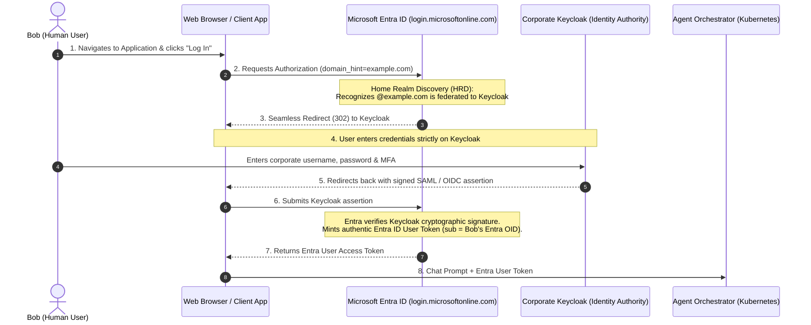
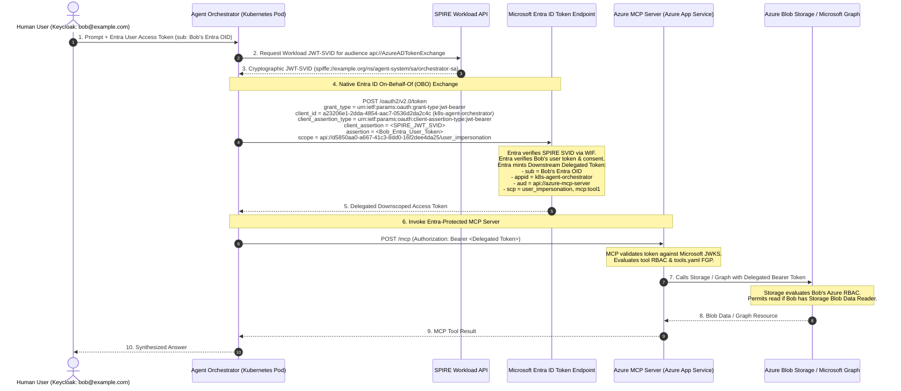
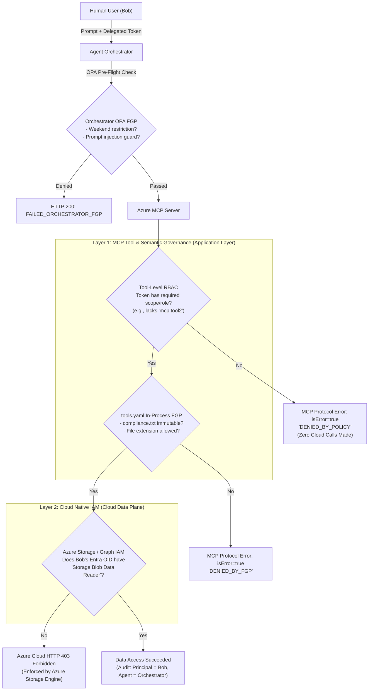
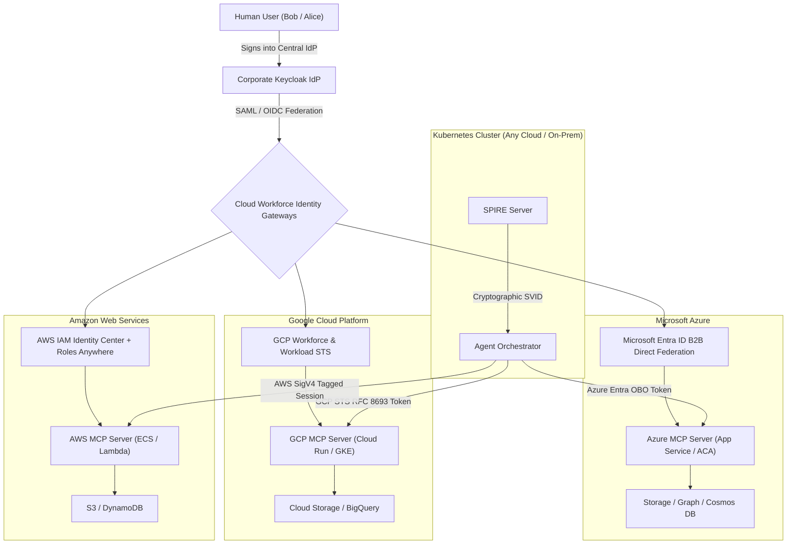

# Microsoft Entra ID Direct Federation & Multi-Cloud Agentic Architecture

## 1. Executive Summary

In enterprise Agentic AI systems, authorization must balance two competing requirements:
1. **Centralized Enterprise Identity**: Human users must be managed in the corporate Identity Provider (**Keycloak**), where credentials, directory groups, and Multi-Factor Authentication (MFA) reside.
2. **Cloud Resource Governance**: Cloud services (Azure Storage, Cosmos DB, Microsoft Graph, AWS S3, GCP BigQuery) must enforce fine-grained access based on the **human user's delegated permissions**, avoiding over-privileged service accounts or unverified headers.

This document formalizes **Approach 2: Direct Workforce & Workload Federation with Native On-Behalf-Of (OBO)**, providing end-to-end architecture diagrams, token flows, dual-layer policy enforcement models, and multi-cloud extension patterns across Azure, GCP, and AWS.

---

## 2. End-to-End User Experience (UX Flow)

Bob (`bob@example.com`) logs into **Keycloak only**. He **never** has a password in Microsoft Entra ID, and **never** enters credentials twice.

### Key UX Highlights:
- **Zero Entra Passwords**: Passwords and credentials never touch Microsoft Entra ID.
- **Single Sign-On (SSO)**: If Bob already has an active session with Keycloak, the browser silently bounces through Keycloak and returns to the app in milliseconds without prompting.
- **Delegated Consent**: The first time Bob uses the AI Agent, Entra ID presents a standard OAuth consent dialog (*"Agent Orchestrator would like permission to read storage files on your behalf"*), which Bob accepts once.

---

## 3. Cryptographic Token Flow & Delegation (Azure Native OBO)

This sequence illustrates the cryptographic separation between the **Human Identity** (Keycloak via Entra Federation) and the **Workload Identity** (Kubernetes SPIFFE/SPIRE):

---

## 4. Dual-Layer Policy Enforcement Model

Authorization is enforced at two distinct, complementary boundaries:

### Responsibility Matrix:

| Policy Concern | Layer 1: MCP Tool Governance | Layer 2: Cloud Native IAM |
| :--- | :--- | :--- |
| **Tool Execution Permission** | **Enforced**: Only authorized tools can be triggered (`mcp:tool1` vs `mcp:tool2`). | N/A: Cloud has no concept of AI tools. |
| **Semantic & File-Level Rules** | **Enforced**: In-process `tools.yaml` blocks tampering with `compliance.txt` or `.exe` files. | Coarse: Cloud RBAC grants broad container access. |
| **Data Plane Access Control** | Pre-filtered: Rejects unauthorized requests early. | **Enforced**: Azure Storage cryptographically ensures Bob has role assignments. |
| **Confused Deputy Prevention** | Mitigated by checking caller `appid` and `sub`. | **Completely Prevented**: Storage only honors Bob's signed token. |
| **Audit Trail Location** | Application / App Service logs (`principal`, `actingAgent`, `decision`). | Azure Storage Analytics, Log Analytics, Microsoft Sentinel (`Caller: Bob's OID`). |

---

## 5. Multi-Cloud Architecture (Azure, GCP, AWS)

This architecture is completely cloud-agnostic. The enterprise maintains **one central Keycloak IdP** and **one Kubernetes SPIRE infrastructure**, federating out to each cloud's federation gateway:

### Multi-Cloud Mapping:

| Capability | Azure Implementation | GCP Implementation | AWS Implementation |
| :--- | :--- | :--- | :--- |
| **Workforce Federation** | **Entra B2B Direct Federation** (SAML/OIDC) | **GCP Workforce Identity Federation** | **AWS IAM Identity Center** |
| **Workload Federation** | **Azure WIF (RFC 7523)** | **GCP Workload Identity Federation** | **AWS IAM Roles Anywhere / STS** |
| **Delegated User Exchange** | Entra ID OBO Grant (`grant_type=jwt-bearer`) | GCP STS Token Exchange (RFC 8693) | AWS STS `AssumeRole` with Session Tags |
| **Data Plane IAM** | Azure Storage / Graph RBAC | Cloud Storage / BigQuery IAM Conditions | S3 Bucket Policy / DynamoDB IAM |
| **Tool Governance** | Declarative MCP (`tools.yaml`) | Declarative MCP (`tools.yaml`) | Declarative MCP (`tools.yaml`) |

---

## 6. Setup Guide: Configuring Federation between Keycloak & Microsoft Entra ID

There are two methods to establish federation between your Keycloak instance and Microsoft Entra ID:

### Method A: Entra External Identities (SAML 2.0 Direct Federation) - Recommended for B2B

In this pattern, Microsoft Entra ID acts as the Relying Party and delegates authentication for `@example.com` to Keycloak via SAML 2.0.

#### 1. In Keycloak:
1. Navigate to realm `azure-wif-realm` ➔ **Clients** ➔ **Create Client**:
   - **Client type**: `SAML`
   - **Client ID**: `https://login.microsoftonline.com/81f26b58-159c-4879-80a0-bab30b5b4dd3/federation`
   - **Name**: `Microsoft Entra Direct Federation`
2. Configure Client Settings:
   - **Sign Assertions**: `ON`
   - **Sign Documents**: `ON`
   - **Signature Algorithm**: `RSA_SHA256`
   - **Master SAML Processing URL**: `https://login.microsoftonline.com/common/federation/externalfederationauth`
3. Add Protocol Mappers:
   - Map `email` to SAML Attribute: `http://schemas.xmlsoap.org/ws/2005/05/identity/claims/emailaddress`
   - Map `username` to SAML NameID: `urn:oasis:names:tc:SAML:1.1:nameid-format:emailAddress`
4. Export the SAML Signing Certificate:
   - Realm Settings ➔ **Keys** ➔ Certificate under `RS256` (download as `keycloak-saml.cer`).

#### 2. In Microsoft Entra ID:
1. Open **Azure Portal** ➔ **Microsoft Entra ID** ➔ **External Identities** ➔ **All identity providers**.
2. Click **+ New SAML/WS-Fed IdP**:
   - **Identity provider protocol**: `SAML`
   - **Domain name**: `example.com` (or your partner email domain)
   - **Issuer URI**: `http://<keycloak-host>:8080/realms/azure-wif-realm`
   - **Passive sign-in endpoint**: `http://<keycloak-host>:8080/realms/azure-wif-realm/protocol/saml`
   - **Certificate**: Upload `keycloak-saml.cer`
3. Click **Save**.

---

### Method B: Keycloak Identity Brokering with Microsoft Entra ID

In this pattern, Keycloak acts as the Relying Party, allowing users to sign in with their Microsoft Entra account or brokering identity tokens.

#### 1. In Microsoft Entra ID:
1. Navigate to **App registrations** ➔ **New registration**:
   - **Name**: `keycloak-identity-broker`
   - **Redirect URI**: `Web` ➔ `http://localhost:8080/realms/azure-wif-realm/broker/microsoft/endpoint`
2. Create Client Secret:
   - **Certificates & secrets** ➔ **New client secret**.
3. Expose API Permissions:
   - `User.Read`, `offline_access`.

#### 2. In Keycloak:
1. Open **Identity Providers** ➔ **Add provider...** ➔ **Microsoft** (or **OpenID Connect v1.0**).
2. Enter:
   - **Client ID**: `<ENTRA_APP_ID>`
   - **Client Secret**: `<ENTRA_CLIENT_SECRET>`
   - **Default Scopes**: `openid profile email offline_access`
3. When Bob visits the application, clicking "Sign in with Corporate SSO" delegates to Entra ID, returning an authentic Entra User Token.
