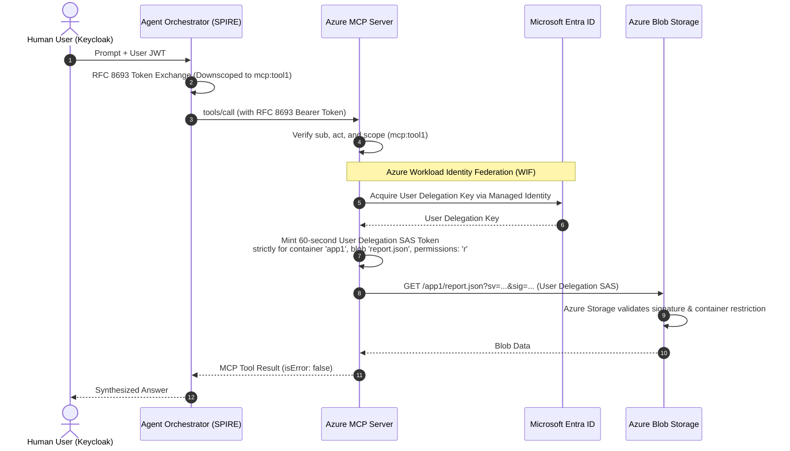

# Architectural Analysis: Direct Azure Storage RBAC vs. Application-Enforced Delegated Access in Agentic AI

## 1. Executive Summary & Problem Context

In our Proof of Concept (POC), **Alice (Security Admin)** and **Bob (Regular User)** do not have individual Service Principals or Entra ID accounts provisioned in Azure. Furthermore, they do not have direct Azure Storage RBAC role assignments (`Storage Blob Data Reader` or `Storage Blob Data Contributor`) on storage containers `app1` or `app2`.

Yet, when Alice or Bob prompts the AI Agent:
- Bob can read and write files in `app1` and `app2` using `tool1`.
- Bob is blocked from auditing `app1` using `tool2`.
- Alice can audit `app1` using `tool2`.

This raises a fundamental enterprise security and architectural question:
> **"Should this pattern be allowed, or should the design be changed so that every human user has a direct Azure identity and storage ACLs in the cloud?"**

This document evaluates this architecture against **NIST SP 800-207 (Zero Trust)**, **OAuth 2.0 RFC 8693 (Token Exchange)**, and **Microsoft Entra ID Best Practices for AI Agents**, detailing trade-offs, threat models, and evolutionary recommendations.

---

## 2. Comparison of Architectural Patterns

```mermaid
graph TD
    subgraph Pattern_A["Pattern A: Trusted Subsystem / Tool-Governed Gateway (Current POC)"]
        A_User["Human User (Keycloak IdP)"] -->|User JWT| A_Agent["Agent Orchestrator (SPIRE Identity)"]
        A_Agent -->|RFC 8693 Downscoped OBO Token| A_MCP["Azure MCP Server (App Service)"]
        A_MCP -->|Declarative Policy & Scope Check| A_Policy{"tools.yaml Check<br/>sub, act, scope"}
        A_Policy -->|Server Azure Managed Identity| A_Storage["Azure Storage Account<br/>(app1, app2)"]
    end

    subgraph Pattern_B["Pattern B: End-to-End Cloud IAM Delegation (Pure User Impersonation)"]
        B_User["Human User (Entra ID Account)"] -->|Entra User Token| B_Agent["Agent Orchestrator"]
        B_Agent -->|Entra OBO Exchange| B_Entra["Microsoft Entra ID Token Endpoint"]
        B_Entra -->|Delegated Storage Token| B_Agent
        B_Agent -->|User Delegated Bearer Token| B_Storage["Azure Storage Account<br/>(Enforces Azure RBAC per User)"]
    end
```

---

### Pattern A: Trusted Subsystem / Tool-Governed Gateway (Current POC Design)

In this pattern, the **MCP Server** acts as an authorized gateway and policy enforcement point (PEP). The MCP Server holds an Azure identity (Managed Identity) with access to the storage account, but it **never** exposes the raw storage data plane directly to clients or agents. It strictly executes declarative tools (`tool1`, `tool2`) governed by the user's RFC 8693 delegated claims (`sub`, `act.sub`, `scope`).

#### Advantages
1. **Semantic & Dynamic Policy Enforcement**:
   - Azure Storage RBAC is coarse-grained: roles like `Storage Blob Data Reader` grant read access to *all* blobs across a container or account.
   - The MCP gateway enforces semantic, AI-specific guardrails defined in `tools.yaml`:
     - Restricting specific operations (e.g., `tool2` permits `read` only, never `write`).
     - Restricting filenames (e.g., regex patterns, sensitive file blocklists).
     - Downscoping permissions based on prompt context and intent.
2. **Identity Decoupling & Multi-IdP Interoperability**:
   - In modern multi-cloud or hybrid environments, human users often reside in external enterprise IdPs (Okta, Keycloak, Ping Federate, Google Workspace).
   - Provisioning, synchronizing, and licensing every internal and external user as a full Azure Entra ID user is costly and administratively heavy.
3. **Defense Against Prompt Injection & SSRF**:
   - The agent workload never receives raw Azure Storage credentials or connection strings.
   - If the LLM produces an adversarial prompt, the MCP server's declarative validator rejects unauthorized container targets before any network call to storage occurs.
4. **Avoidance of Azure Subscription Limits**:
   - Azure Resource Manager enforces a limit of **4,000 role assignments per subscription**. In an enterprise with 50,000 users, assigning direct container-level RBAC to individuals quickly breaches cloud provider quotas.

#### Risks & Limitations
- **Confused Deputy Risk**: If a vulnerability or logic bug exists in the MCP server's authorization check, the MCP server could access data on behalf of an unauthorized caller.
- **Audit Obfuscation in Native Cloud Logs**: Azure Monitor and Azure Storage Analytics log the MCP Server's Managed Identity (or connection string) as the caller at the cloud infrastructure layer, unless the MCP server emits high-fidelity application audit logs with the human `sub` and agent `act.sub` (as implemented in this POC).

---

### Pattern B: End-to-End Cloud IAM Delegation (Direct Storage RBAC)

In this pattern, every human user is an account in Microsoft Entra ID. Storage RBAC roles (`Storage Blob Data Reader` on `app1`, `Storage Blob Data Contributor` on `app2`) are bound directly to Alice and Bob in Azure Portal. The agent exchanges the user's token via Entra ID OBO to obtain a token scoped to `https://storage.azure.com/.default` and calls Azure Storage REST APIs directly.

#### Advantages
1. **Defense-in-Depth at Data Plane**:
   - Even if the Agent Orchestrator or MCP code is completely compromised or subverted via prompt injection, Azure Storage's kernel-level IAM rejects the request if Bob's Entra identity lacks rights to `app1`.
2. **Native Cloud Forensic Audit**:
   - Azure Storage Diagnostic Logs natively display Bob's Entra Object ID (`oid`) as the caller in Azure Log Analytics and Microsoft Sentinel.

#### Risks & Limitations
1. **Lack of Tool-Level & Semantic Control**:
   - Azure Storage IAM has no concept of "tools", "audit mode", or "agent intentions". If Bob has `Storage Blob Data Reader` on `app1`, he can read *all* blobs in `app1` at all times, making read-only audit tools with restricted parameters impossible to enforce at the IAM layer.
2. **High Cloud Licensing & Management Overhead**:
   - Requires syncing all users to Entra ID, managing thousands of container-level role assignments, and paying for Entra ID P1/P2 governance.
3. **Agent Workload Proliferation**:
   - The agent requires direct network egress to Azure Storage endpoints (`*.blob.core.windows.net`), increasing the attack surface.

---

## 3. Threat Modeling & Risk Matrix

| Threat / Scenario | Pattern A: Gateway / MCP (Current) | Pattern B: Direct Entra RBAC | Pattern C: Hybrid Zero-Trust (Recommended) |
| :--- | :--- | :--- | :--- |
| **Prompt Injection Attack** | **Strong Protection**: Declarative schema in `tools.yaml` restricts parameters before execution. | **Moderate**: LLM can execute any operation the user's broad IAM role allows. | **Strongest**: Dual validation (MCP schema + dynamic short-lived scoped token). |
| **Confused Deputy Attack** | **Mitigated by RFC 8693**: The MCP server strictly checks `sub` and `scope` before every read/write. | **Natively Prevented**: Azure Storage IAM validates caller token directly. | **Natively Prevented**: Scoped token mathematically restricts accessible container. |
| **Audit Trail Integrity** | **Application Audit**: MCP emits `principal`, `actingAgent`, `decision` in structured logs. | **Infrastructure Audit**: Azure Storage logs show user OID directly. | **Unified Audit**: Both application logs and Azure Storage logs record delegation. |
| **Scalability (>5,000 users)** | **High**: Zero Azure RBAC role assignments per user needed. | **Poor**: Hits Azure 4,000 role assignment limit; heavy sync burden. | **High**: Uses User Delegation SAS or Azure ABAC conditions. |

---

## 4. Best Practice Recommendations

### Should the current design be allowed?
**YES, it is valid and represents the industry-standard "Trusted Subsystem" / "API Gateway PEP" pattern**, provided the following conditions are met:
1. **The MCP Server strictly validates the RFC 8693 token** (`sub`, `act.sub`, `scope`) before every tool invocation (already implemented in this POC).
2. **The MCP Server emits structured audit events** detailing the human principal, acting agent SPIFFE ID, requested tool, and decision (already implemented in this POC and visible in Azure App Service logs).
3. **The Agent cannot bypass the MCP Server** to reach the storage account directly (enforced by network boundary).

---

## 5. Evolution to "Pattern C": The Enterprise Hybrid Zero-Trust Model

For production banking, healthcare, or defense deployments where cloud security teams mandate that **Azure Storage itself** enforces access control without provisioning 50,000 Entra role assignments, the recommended evolution is **User Delegation Shared Access Signatures (SAS)**:

### Key Highlights of the Hybrid Model:
1. **Dynamic Just-In-Time Scoping**: The MCP Server uses its Azure Managed Identity to request a **User Delegation Key** from Entra ID, then signs a 60-second User Delegation SAS scoped *strictly* to the exact blob and action permitted by the user's RFC 8693 scope.
2. **Dual-Layer Enforcement**:
   - Layer 1: MCP Server validates tool authorization, user identity, and agent SPIFFE ID.
   - Layer 2: Azure Storage cryptographically validates that the SAS token only grants access to that specific blob.
3. **No Individual Entra Accounts Required**: External users remain in Keycloak/Okta, avoiding Entra ID licensing and role assignment limits, while Azure Storage enforces cryptographic containment.
