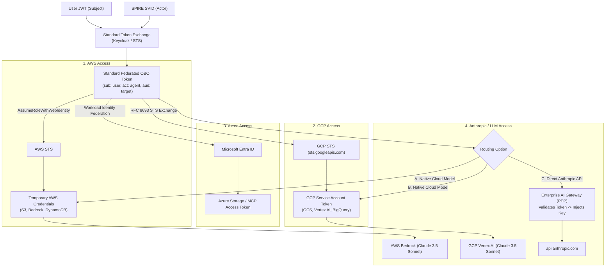
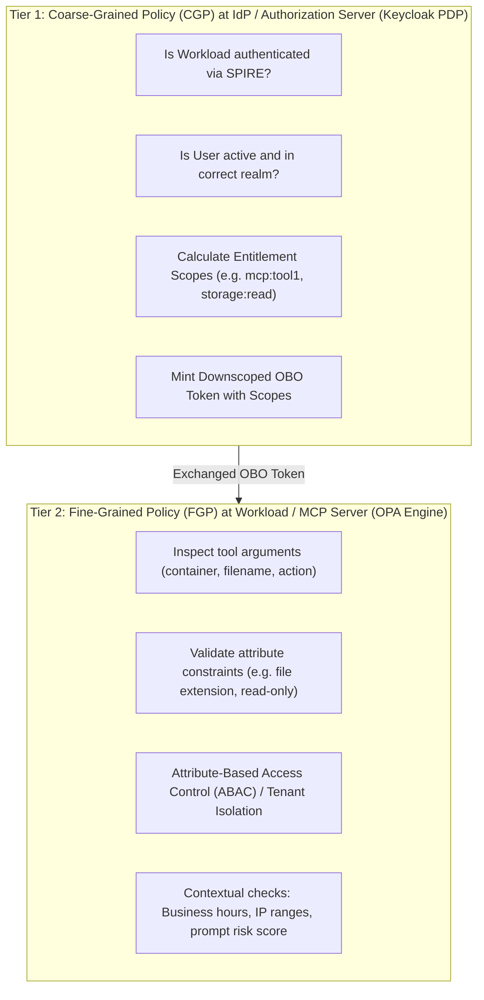

# Standardized RFC 8693 Token Exchange & Fine-Grained Policy (FGP) Architecture

## 1. Executive Summary

This document addresses three critical enterprise requirements for scaling agentic AI workloads across multi-cloud and SaaS environments:

1. **Standardized, Off-the-Shelf RFC 8693 Token Exchange**: Eliminating custom in-application token exchange engines by utilizing standard Identity Providers (IdPs) like **Keycloak** or **Ory Hydra** with full **RFC 7523** compliance (SPIRE JWT-SVID as client/actor assertions).
2. **Generic Cross-Cloud Identity Federation**: Using standard token exchange to access **AWS**, **GCP**, **Azure**, and **Anthropic/LLM APIs** without hardcoding cloud-specific credentials.
3. **Decoupled Governance: Coarse-Grained Policy (CGP) at the IdP vs. Fine-Grained Policy (FGP) with Open Policy Agent (OPA) in MCP Servers**: Defining declarative FGP in `tools.yaml` and enforcing it at tool runtime.

---

## 2. Off-the-Shelf RFC 8693 & RFC 7523 Token Exchange with Standard IdPs

```mermaid
graph LR
    subgraph K8s["Kubernetes Cluster"]
        Workload["Agent Workload<br/>(SPIFFE Identity)"]
        SpireAgent["SPIRE Agent<br/>(OIDC Provider)"]
        Keycloak["Keycloak IdP<br/>(RFC 8693 + RFC 7523 Enabled)"]
    end

    subgraph Clouds["Target Cloud & SaaS Providers"]
        AWS["AWS STS<br/>(AssumeRoleWithWebIdentity)"]
        GCP["GCP STS<br/>(Workload Identity Federation)"]
        Azure["Azure Entra ID<br/>(Workload Identity Federation)"]
        Anthropic["Anthropic Claude<br/>(via Bedrock, Vertex, or AI Gateway)"]
    end

    Workload -->|1. Fetch JWT-SVID| SpireAgent
    Workload -->|2. RFC 8693 Token Exchange<br/>Actor: JWT-SVID (RFC 7523)<br/>Subject: User JWT| Keycloak
    Keycloak -->|3. Evaluate Coarse Policy / Mint Downscoped Token| Workload
    Workload -->|4a. Federated Exchange| AWS
    Workload -->|4b. RFC 8693 Federated Exchange| GCP
    Workload -->|4c. Federated Exchange| Azure
    Workload -->|4d. Authenticated Invocation| Anthropic
```

### 2.1 Can Keycloak Provide This Natively?
**Yes.** Keycloak provides built-in support for **OAuth 2.0 Token Exchange (RFC 8693)** via the `token-exchange` feature flag (`KC_FEATURES=token-exchange`).

#### Standard RFC 8693 Parameters Handled by Keycloak:
- `grant_type`: `urn:ietf:params:oauth:grant-type:token-exchange`
- `subject_token`: The original Human User's JWT (from Keycloak login, Okta, or external OIDC).
- `subject_token_type`: `urn:ietf:params:oauth:token-type:access_token`
- `actor_token`: The Agent's SPIRE JWT-SVID.
- `actor_token_type`: `urn:ietf:params:oauth:token-type:jwt`
- `audience`: Target resource (e.g. `azure-mcp-server`, `aws-storage`, `gcp-data`).
- `scope`: Requested downscoped scopes (e.g. `mcp:tool1`).

### 2.2 Compliance with RFC 7523 (SPIRE JWT-SVID as Actor Identity)
RFC 7523 specifies how JWTs are used for OAuth 2.0 client authentication and authorization grants.

1. **Attestation Chain**:
   - SPIRE runs the **SPIRE OIDC Discovery Provider** exposing `https://spire-oidc.internal/.well-known/openid-configuration` and `/keys` (JWKS).
   - Keycloak is configured with SPIRE as a trusted Identity Provider or Keystore.
2. **Client Authentication via RFC 7523**:
   When the agent calls Keycloak's `/protocol/openid-connect/token` endpoint, it presents:
   - `client_assertion_type`: `urn:ietf:params:oauth:client-assertion-type:jwt-bearer`
   - `client_assertion`: The SPIRE JWT-SVID signed by the SPIRE Server's private key.
3. **Delegation Verification**:
   Keycloak validates the cryptographic signature of the SPIRE JWT-SVID against SPIRE's JWKS, authenticates the workload client (`spiffe://example.org/ns/agent-system/sa/orchestrator-sa`), and verifies the user's `subject_token`.

### 2.3 Other Off-The-Shelf IdP Options
| Product | RFC 8693 Support | RFC 7523 Support | SPIRE Integration | Deployment Model |
| :--- | :--- | :--- | :--- | :--- |
| **Keycloak** | **Native** (`token-exchange`) | **Native** (`private_key_jwt`) | **Direct** (via JWKS URL) | Self-hosted K8s / VM |
| **Ory Hydra** | **Via Token Exchange plugin** | **Native** | **Direct** | Cloud-native Go binary |
| **PingFederate** | **Full Native Enterprise** | **Full Native** | **Direct** | Enterprise On-Prem / Cloud |
| **HashiCorp Vault** | **Identity Secrets Engine** | **Native OIDC** | **Direct** (SPIFFE Auth) | Secrets Broker / Minting |
| **Okta / Auth0** | Requires Custom Actions / Beta | Native Client Assertions | API-based federation | SaaS Managed |

---

## 3. Multi-Cloud & Anthropic Token Federation Strategy

How does a single standard token exchange allow access across **AWS**, **GCP**, **Azure**, and **Anthropic**?



### 3.1 AWS Integration
- **Mechanism**: AWS Security Token Service (`sts:AssumeRoleWithWebIdentity`).
- **Flow**: The agent presents the exchanged OIDC token to AWS STS. AWS validates the signature against Keycloak/SPIRE's OIDC discovery endpoint and returns temporary AWS credentials (`AccessKeyId`, `SecretAccessKey`, `SessionToken`).
- **Audit**: AWS CloudTrail records the federated identity session with the user principal and agent actor.

### 3.2 GCP Integration
- **Mechanism**: GCP Workload Identity Federation via **GCP STS (`sts.googleapis.com`)**.
- **Flow**: GCP STS natively implements RFC 8693! The agent calls `https://sts.googleapis.com/v1/token` with `grant_type=urn:ietf:params:oauth:grant-type:token-exchange` and `subject_token=<OIDC_Token>`. GCP exchanges it for a federated GCP token to access Google Cloud Storage, BigQuery, etc.

### 3.3 Azure Integration
- **Mechanism**: Azure Entra ID Workload Identity Federation (WIF).
- **Flow**: Azure App Service / AKS validates the federated token against Keycloak/SPIRE, issuing Azure Resource Manager tokens for Storage, Key Vault, or Azure OpenAI.

### 3.4 Anthropic Claude Integration
Anthropic's direct public API (`https://api.anthropic.com/v1/messages`) authenticates via static API keys (`x-api-key`), not OAuth OIDC. In an enterprise setting, you have two recommended best practice options:
1. **Option 1 (Cloud-Native IAM - Recommended)**:
   Invoke Anthropic Claude models via **AWS Bedrock** (`anthropic.claude-3-5-sonnet...`) or **GCP Vertex AI**.
   - This eliminates all static API keys.
   - You authenticate using the federated AWS or GCP temporary tokens obtained via steps 3.1 or 3.2.
2. **Option 2 (Enterprise AI Gateway / PEP)**:
   If invoking `api.anthropic.com` directly:
   - Deploy an AI Gateway (e.g. Kong, Envoy, LiteLLM, Cloudflare AI Gateway) as the Policy Enforcement Point (PEP).
   - The agent calls the AI Gateway with its RFC 8693 Bearer Token.
   - The Gateway validates the token's `sub`, `act.sub`, and checks user token quotas.
   - The Gateway securely injects the enterprise Anthropic API Key and proxies the request to Anthropic.

---

## 4. Policy Division: Coarse-Grained (IdP) vs. Fine-Grained (OPA)

To achieve scalable zero-trust governance, policy enforcement must be divided into two distinct tiers:



| Dimension | Coarse-Grained Policy (CGP) | Fine-Grained Policy (FGP) |
| :--- | :--- | :--- |
| **Enforcement Point (PEP)** | Keycloak / Central IdP / Token Exchange | Microservice / MCP Server / OPA Sidecar |
| **Decision Point (PDP)** | Keycloak Authorization Services | Open Policy Agent (OPA) / Rego Engine |
| **Inputs Available** | User roles, client identity, target audience, coarse scopes | Full request body, tool arguments, file paths, environmental context, tenant attributes |
| **Evaluation Speed** | Evaluated at token issuance time (cached for token lifespan) | Evaluated per invocation (sub-millisecond local OPA check) |
| **Examples** | Can user `bob` call `mcp-server`? Scopes: `[mcp:tool1]` | Can user `bob` write file `audit.json` in container `app1` on Sunday at 2 AM? |

---

## 5. Defining & Enforcing FGP in `tools.yaml` for MCP Servers

How can MCP servers define Fine-Grained Policies declaratively in `tools.yaml` and execute them via Open Policy Agent (OPA)?

### 5.1 Option A: Declarative CEL / Condition Expressions in `tools.yaml`
For simple attribute rules, embed declarative expression rules directly into `tools.yaml`:

```yaml
version: "2026-07-15"
tools:
  - name: "tool1"
    title: "Storage Read/Write Tool"
    description: "Read and write data blobs across authorized enterprise containers"
    required_scope: "mcp:tool1"
    allowed_containers: ["app1", "app2"]
    
    # Declarative Fine-Grained Policies (FGP)
    fine_grained_policies:
      # Rule 1: Prevent writing to compliance or production configs
      - id: "protect_critical_files"
        effect: "DENY"
        condition: "args.action == 'write' && (args.filename.matches('^.*(compliance|config|prod).*$'))"
        message: "Modifying compliance or production configuration files is forbidden."
        
      # Rule 2: Tenant Isolation Check
      - id: "tenant_boundary"
        effect: "DENY"
        condition: "args.container == 'app2' && !auth.user.roles.contains('admin') && auth.user.department != 'DataOperations'"
        message: "Access to app2 container requires DataOperations department membership or Admin role."

      # Rule 3: File Extension Whitelist
      - id: "allowed_extensions"
        effect: "DENY"
        condition: "!args.filename.matches('^.*\\.(json|txt|csv|yaml)$')"
        message: "Only structured data formats (.json, .txt, .csv, .yaml) may be processed."
```

### 5.2 Option B: Native OPA / Rego Integration in `tools.yaml`
For complex enterprise authorization (e.g. database lookups, temporal rules, role hierarchies), link `tools.yaml` to an **OPA Policy Document**:

```yaml
version: "2026-07-15"
tools:
  - name: "tool2"
    title: "Security Audit Tool"
    description: "Read-only compliance audit tool for app1"
    required_scope: "mcp:tool2"
    
    # Delegate to Open Policy Agent (OPA)
    opa_policy:
      endpoint: "http://localhost:8181/v1/data/mcp/tool2/allow"
      policy_file: "policies/mcp_tool2_authz.rego"
      fail_closed: true
```

#### Corresponding Rego Policy (`policies/mcp_tool2_authz.rego`):
```rego
package mcp.tool2

default allow = false
default reason = "Default deny: unauthorized tool execution"

# Allow rule evaluated by OPA
allow {
    # 1. Verify required scope
    input.auth.scopes[_] == "mcp:tool2"
    
    # 2. Strict read-only enforcement
    input.args.action == "read"
    input.args.container == "app1"
    
    # 3. Restrict file types
    valid_file_extension
    
    # 4. Temporal rule: Only permitted during audit windows (e.g., weekdays)
    not weekend_access
}

valid_file_extension {
    endswith(input.args.filename, ".json")
}

valid_file_extension {
    endswith(input.args.filename, ".txt")
}

weekend_access {
    input.context.day_of_week == "Saturday"
}

weekend_access {
    input.context.day_of_week == "Sunday"
}
```

### 5.3 How the MCP Server Executes FGP at Runtime

```javascript
// MCP Server Tool Execution Pipeline
async function executeTool(toolName, args, authContext) {
  const toolDef = toolMap.get(toolName);

  // 1. Tier 1: Coarse-Grained Scope Check (From RFC 8693 Token)
  if (!authContext.scopes.includes(toolDef.required_scope)) {
    return denyToolAccess("Lacks required scope: " + toolDef.required_scope);
  }

  // 2. Tier 2: Fine-Grained Policy (FGP) Evaluation via OPA
  if (toolDef.opa_policy) {
    const opaPayload = {
      input: {
        auth: {
          sub: authContext.sub,
          actor: authContext.act?.sub,
          roles: authContext.roles,
          scopes: authContext.scopes
        },
        args: args,
        context: {
          timestamp: new Date().toISOString(),
          day_of_week: new Intl.DateTimeFormat('en-US', { weekday: 'long' }).format(new Date())
        }
      }
    };

    const opaDecision = await evaluateOpaPolicy(toolDef.opa_policy.endpoint, opaPayload);
    if (!opaDecision.result) {
      return {
        isError: true,
        content: [{ type: "text", text: `FGP Denial by OPA: ${opaDecision.reason || 'Policy constraint violated.'}` }],
        audit: { decision: "DENIED_BY_OPA_POLICY", tool: toolName, principal: authContext.sub }
      };
    }
  }

  // 3. Execute Tool Action
  return executeBackendOperation(args);
}
```

---

## 6. Implementation Roadmap for Your Architecture

1. **Enable Native Keycloak Token Exchange**:
   - Run Keycloak with `KC_FEATURES=token-exchange,scripts`.
   - Register the SPIRE OIDC Discovery Provider endpoint in Keycloak to validate incoming SPIFFE JWT-SVIDs via RFC 7523.
2. **Deploy OPA Sidecar or WASM Engine**:
   - In Kubernetes, deploy `openpolicyagent/opa:latest` as a sidecar container alongside the MCP Server pod, or use `@open-policy-agent/opa-wasm` directly in Node.js.
3. **Enhance `tools.yaml` with Fine-Grained Conditions**:
   - Add parameter filters, regex validations, and tenant isolation policies directly into `tools.yaml`.
4. **Cloud Multi-Provider Connectors**:
   - Configure AWS IAM Roles Anywhere or AWS OIDC Federation for S3 and Bedrock Claude.
   - Configure GCP Workload Identity Pools for GCS and Vertex AI Claude.
   - Use the single exchanged OBO token as the federated credential for all downstream targets.
